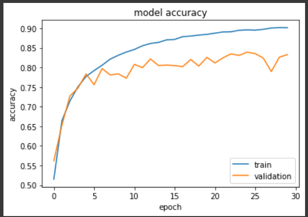

# CIFAR10-TensorFlow

## Description

This is an image classifier made using TensorFlow.

Images were loaded from the CIFAR10 dataset and augmented as part of data preprocessing. This expanded the available dataset before model training. A CNN followed by dense layers was used to classify images. Batch normalization was used to improve computational efficiency.

## Applicaition

Image classification is a major branch of computer vision. It is relevant to quality control, facial recognition, and other use cases.

## Results

In model_v3, overfitting was decreased as compared to previous versions. Train accuracy capped at approximately %90.

## Key Learnings

I learned how to augment relatively small datasets for ML applicaitons. Often, dataset size limitations may apply. Applying matrix transformations on existing data may help circumvent this limitation, saving time and data collection costs. I also learned of appropriate CNN and dense layer structures and hyperperameters for image classifiers. Doubling filters in subsequent convolutional layers appears to improve accuracy metrics.

## Future Considerations

To improve train accuracy, I may try adding increased complexity to the CNN. This may increase accuracy beyond %90. To prevent overfitting when the CNN is langthened, I may add dropout layers with a dropout rate of 0.2. Also, current image augmentations include flips, rotations, translations, and contrast adjustments. In the future, I may try other augmantations, and develop custom matrix transformations.